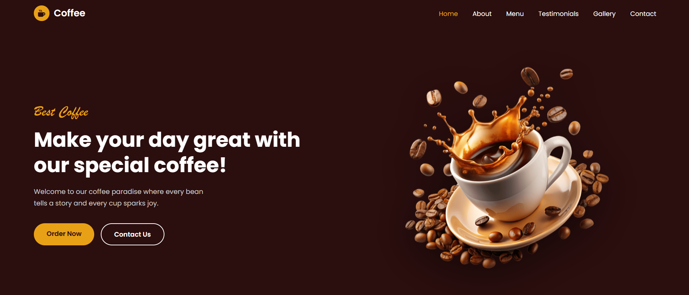

# ☕ Coffee House - Responsive Website

A fully responsive Coffee Shop landing page built with HTML, CSS, and JavaScript.

>  Inspired by a design found on YouTube — recreated and customized for learning purposes.

## 🔗 Live Demo
[Click here to view the website](https://NoorULEman023.github.io/Coffee-Website)

##  Preview

##  Features
- ✅ Responsive Design (Mobile, Tablet, Desktop)
- ✅ Fixed Navigation Bar with active link highlight
- ✅ Hero Section with floating animation
- ✅ About Section with circular image
- ✅ Menu Section with 6 categories
- ✅ Testimonials Slider with dots
- ✅ Photo Gallery Grid
- ✅ Contact Form with validation
- ✅ Footer with social links

## 🛠️ Technologies Used
- HTML5
- CSS3 (Flexbox & Grid)
- JavaScript (Vanilla JS)
- Font Awesome Icons
- Google Fonts (Poppins, Pacifico)

## 📁 Project Structure
Coffee-Website/

├── index.html

├── about-image.jpg

├── coffee-hero-section.png

├── hot-beverages.png

├── cold-beverages.png

├── refreshment.png

├── special-combo.png

├── desserts.png

├── burger-frenchfries.png

├── gallery-1.jpg

├── gallery-2.jpg

├── gallery-3.jpg

├── gallery-4.jpg

├── gallery-5.jpg

├── gallery-6.jpg

├── user-1.jpg

├── user-2.jpg

├── user-3.jpg

└── user-4.jpg
##  Author
**Noor UL Eman**
- GitHub: [@NoorULEman023](https://github.com/NoorULEman023)

##  Credits
Design inspired by a YouTube tutorial — all code written and customized by me.
